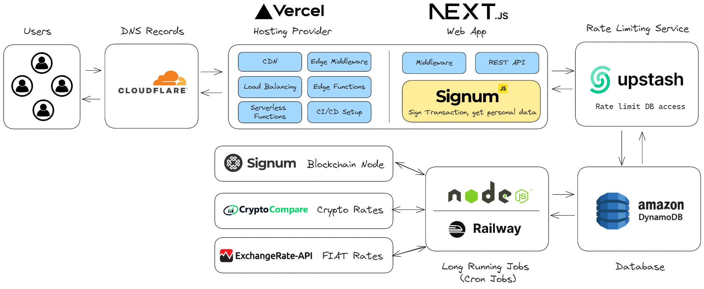

# Quick Fomplo Platform Documentation

Fomplo is one of my first projects i started since april 2021, it has been my great way of learning a lot about blockchain technology and Signum. I feel proud to share this with the Signum community.

### API Endpoints Available for the public

There are API Endpoints i made available for the public interested on Signum. please do not `abuse/exploit` it 🙏🏻

- `/api/edge/converter` Get rates from multiple crypto/fiat
- `/api/edge/mining` Get the latest mining stats from Signum chain
- `/api/edge/network` Get the latest status from Signum chain

You are invited to be curious and use it. let us know how you use it!, it can be really awesome for the community.

### Services

The fomplo website consists of multiple centralized services in order to provide the best experience for the user. We will classify which centralized tools we use.

**Decentralized Tools**

- SignumJS (Signum `Javascript/Typescript` SDK)
- Remaining packages on `package.json`

**Centralized Tools**

- Cloudflare `DNS`
- Vercel `Website Hosting`
- Railway `Long Running Jobs Server Hosting`
- Upstash `Rate Limiting`
- DynamoDB `Database`
- ExchangeRate API `FIAT Rates`
- CryptoCompare API `Cryptocurrency Rates`

### Blockchain Usage

When the user is `Signing transactions` or `fetching personal on-chain data`, the website picks the node indicated by the [Signum XT Wallet](https://signum.network/wallet#XTWallet). This means the user has complete freedom to pick any signum node.

When `fetching non-personal data`, the website uses the `API Endpoints` for efficient queries
